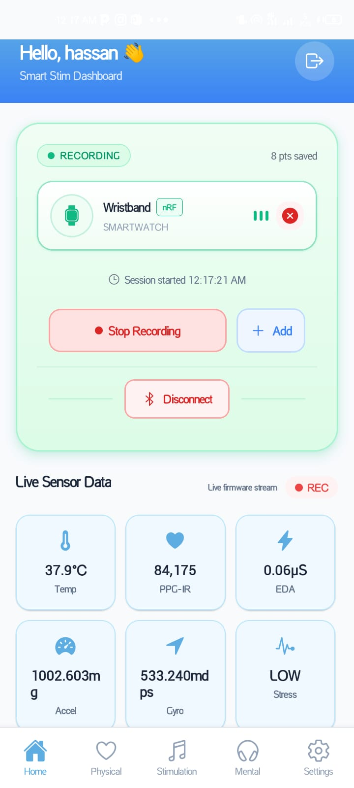

# Medical Wristband — Firmware (nRF52840)

## Project Overview

This repository contains the firmware for an nRF52840-based research medical wristband used for physiological sensing, local storage, and BLE telemetry. The hardware platform for the wristband was developed by the HW team, and the complete firmware stack in this repository was developed by me from scratch.

The device is designed to:

- acquire PPG and motion data in real time,
- process the signals on-device,
- store raw and processed records in external flash,
- stream live telemetry over BLE,
- and support offline inspection through a host-side visualization tool.

This project is intended for research and prototype use, not clinical deployment.

## System Architecture

The system is organized as a sensor-and-processing pipeline:

1. **PPG acquisition** comes from the MAX30101 sensor.
2. **Motion sensing** comes from the LSM6DSO IMU to help detect and suppress motion artifacts.
3. **Optional analog acquisition** is handled by the ADS1113 where needed.
4. **External storage** is provided by the W25N01 flash for logging and later retrieval.
5. **BLE communication** exposes live telemetry and log data to a phone or server.
6. **Algorithm processing** is implemented in `src/algo_v0.c`, where the raw signals are filtered, validated, and converted into HR / SpO2 candidate outputs.
7. **Host visualization** is handled by `tools/GUI_realtime_signals.py` for quick inspection of saved or streamed data.

In practice, the firmware acts as the coordination layer between sensors, storage, and BLE transport. The main application initializes the peripherals, starts the tasks, and keeps the data path flowing with time alignment between PPG and motion streams.

## What the Firmware Does

### 1) Data acquisition

The MAX30101 is sampled in a time-multiplexed fashion to capture red and IR channels. The firmware reads the sensor FIFO, timestamps samples, and places them into the processing pipeline.

The IMU samples are acquired alongside the PPG stream so that motion periods can be detected and used during signal quality estimation.

### 2) Signal preprocessing

The raw PPG waveform includes a large DC component, small pulsatile content, and noise introduced by motion, skin contact variation, and ambient light. The firmware performs preprocessing steps such as:

- DC removal,
- smoothing / windowing,
- bandpass filtering,
- and window-based quality checks.

### 3) Motion artifact handling

Motion is one of the biggest error sources in wearable PPG. The accelerometer and gyroscope data from the LSM6DSO are used to detect unstable windows. Depending on the signal quality, the firmware can:

- flag the window as low confidence,
- suppress unreliable estimates,
- or apply motion-aware correction logic in the processing layer.

### 4) Biometrics estimation

The PPG algorithm pipeline estimates:

- **Heart rate** from detected peaks and inter-beat intervals,
- **SpO2 candidate values** from the ratio-of-ratios method using red and IR channels,
- **Signal quality** so that unstable estimates are not treated as valid measurements.

### 5) Logging and export

Records are stored in the external flash for later analysis. The BLE service allows selected data to be streamed out to a phone or server. This makes it possible to compare live behavior against offline traces.

## Repository Map

- [src/main.c](src/main.c) — application entry point and task setup
- [src/max30101_task.c](src/max30101_task.c) — MAX30101 driver and PPG FIFO handling
- [src/lsm6dso_task.c](src/lsm6dso_task.c) — IMU acquisition and motion tracking
- [src/ads1113_task.c](src/ads1113_task.c) — optional external ADC support
- [src/w25n01_task.c](src/w25n01_task.c) — flash logging and record storage
- [src/ble_log_service.c](src/ble_log_service.c) — BLE GATT characteristics and notifications
- [src/log_backend_ble.c](src/log_backend_ble.c) — BLE-backed logging backend
- [src/algo_v0.c](src/algo_v0.c) — PPG signal processing and estimation logic
- [src/ppg_validation.h](src/ppg_validation.h) — validation helpers and SQI support
- [tools/GUI_realtime_signals.py](tools/GUI_realtime_signals.py) — realtime signal viewer
- [boards/nrf52840dk_nrf52840.overlay](boards/nrf52840dk_nrf52840.overlay) — board-level hardware configuration

## Hardware Overview

- **MCU:** nRF52840 BLE SoC
- **PPG sensor:** MAX30101
- **IMU:** LSM6DSO
- **Flash:** W25N01
- **ADC:** ADS1113
- **Stimulator:** AS6221

The wearable is built around a compact sensing stack that combines optical sensing, inertial sensing, local memory, and wireless telemetry in a single low-power device.

## Privacy and Hardware Availability Note

The hardware schematics/images and detailed board-level hardware files cannot be shared publicly because of privacy and project confidentiality concerns. The firmware in this repository is the part that can be reviewed, extended, and maintained here.

## PPG Processing in Detail

PPG, or photoplethysmography, measures blood volume changes using light emitted into tissue and reflected back into a photodetector. In this system, the red and IR channels are both useful:

- the **IR channel** is typically strong for pulse detection,
- the **red channel** is required for SpO2-related processing,
- and both channels help the algorithm distinguish physiological pulsation from noise.

The firmware processing pipeline is designed around the realities of wearable sensing:

- the signal is small,
- motion introduces strong distortions,
- skin tone and contact pressure matter,
- and the signal must be processed efficiently on-device.

The main PPG stages are:

1. **Acquisition** — read raw FIFO data from MAX30101.
2. **Centering / DC removal** — isolate the pulsatile component.
3. **Filtering** — keep the cardiac band and remove drift.
4. **Motion rejection** — use IMU context to reduce false peaks.
5. **Peak detection** — extract beats and compute intervals.
6. **Estimation** — generate HR and SpO2 candidate outputs.
7. **Validation** — reject windows with low quality.

### Why the IMU matters

Without motion awareness, wearable PPG often produces false heart-rate peaks or unstable oxygen estimates. By pairing the PPG stream with the IMU stream, the firmware can evaluate whether a window is physically trustworthy before using it in the final result.

### Why logging matters

The external flash allows the system to retain raw traces and processed outputs. This is useful because:

- it supports offline debugging,
- it helps compare signal quality across experiments,
- and it provides data for tuning thresholds and filters later.

## Images and References

### App screenshot

The app is the companion visualization interface used to view the wristband output, inspect signals, and verify whether the live data stream, logging, and processing pipeline are behaving as expected.

<div align="center">
  
</div>

### PPG signal examples

<div align="center">
  
</div>

### Heart-rate signal example

<div align="center">
  
</div>

### Final logs example

<div align="center">
  
</div>

### YouTube reference image

<div align="center">
  
</div>

### Web resources

- YouTube reference video: https://www.youtube.com/watch?v=TyjY4OSEqoo
- MAX30101 product information and datasheet resources from Analog Devices / Maxim Integrated
- Nordic nRF52840 documentation and Zephyr RTOS documentation for BLE and firmware structure
- ST LSM6DSO documentation for motion sensing and register-level configuration
- Winbond W25N01 documentation for flash storage behavior

## Quickstart

Prerequisites: Zephyr SDK, `west`, and nRF command-line tools (`nrfjprog`) or Segger J-Link.

Build and flash:

```bash
west build -b nrf52840dk_nrf52840 -s .
west flash
```

Manual CMake and nrfjprog:

```bash
mkdir -p build && cd build
cmake -DBOARD=nrf52840dk_nrf52840 ..
cmake --build .
nrfjprog --program build/zephyr/zephyr.hex --sectorerase --verify
nrfjprog --reset
```

Run the realtime GUI:

```bash
python tools/GUI_realtime_signals.py
```

## Development Workflow

1. Tune parameters in `src/algo_v0.c` and `src/max30101_task.c`.
2. Build and flash the firmware.
3. Record sessions under rest and motion conditions.
4. Retrieve logs over BLE or via flash dump.
5. Inspect the results in the host GUI and refine thresholds as needed.

## Troubleshooting

- Weak signal: increase LED current, check skin contact, and verify optical alignment.
- Motion artifacts: tighten SQI thresholds, tune IMU-based rejection, or improve the filtering window.
- BLE throughput: batch notifications or reduce sample rate.

## Additional Notes

The current firmware structure was developed to keep the signal path modular so each subsystem can be tuned independently. That makes it easier to refine PPG behavior, transport format, and storage logic without rewriting the whole stack.

## What you can ask me to add next

If you want, I can add any of these next:

- a cleaner architecture diagram,
- a block diagram for the PPG pipeline,
- a table of sensors and their roles,
- firmware build/flash instructions for Windows,
- a log format specification for BLE and flash,
- or a short validation/results section.

My ideas for the next useful step are:

1. add a small system block diagram,
2. add a concise data packet format table,
3. add a “results” section with sample metrics or test conditions.

## Next additions

- Extract tunable constants into `src/ppg_config.h` for easier experimentation.
- Add convenience scripts for build and flash.
- Provide a log-to-CSV converter for offline analysis.
